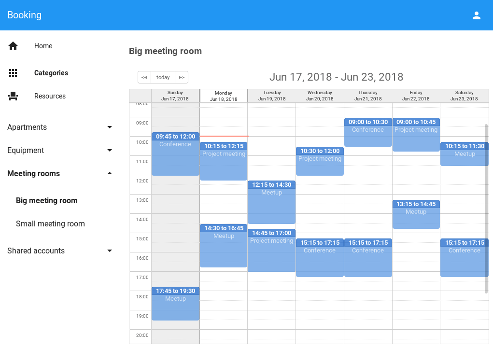
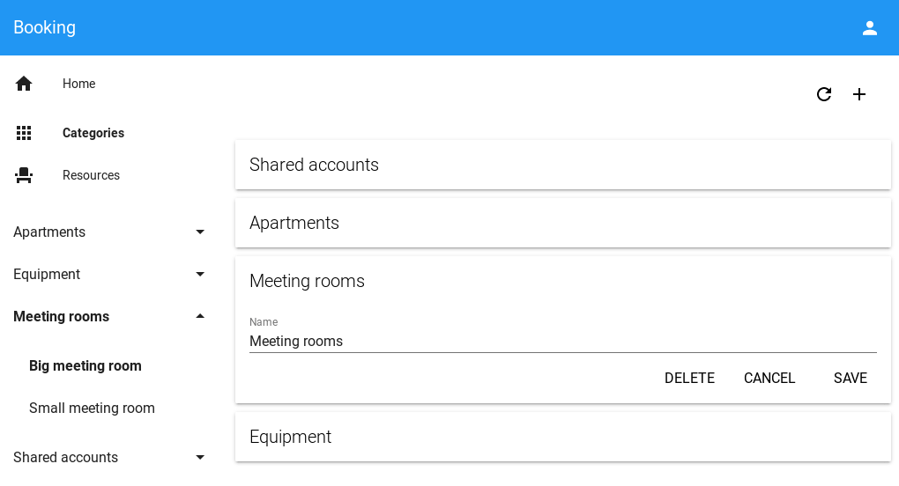

# Booking

This is a simple real-world application for managing office resources.
The feature of this sample is that Polymer client is used as the main UI.
It contains both default views generated by CUBA Studio and custom views and
components.

Here you can find some non-trivial code examples, such as manual entities persisting
or promises combining.

Based on CUBA Platform 6.8.5

## Features

In short, the application solves two problems:

1. It allows to manage resources and its categories that can be booked.
2. It allows to check existing and create new bookings on a custom calendar view.

Some details:

- There are categories that group resources (e.g. Devices or Shared Accounts).
- There are resources that represent real-world objects (e.g. Projector).
- The system consists of three web applications deployed onto one Tomcat instance:
  - Middleware
  - CUBA Generic UI
  - Polymer UI

## Usage

- Open the project in Studio and execute **Run > Create database**, then
**Run > Start application server**.
- The application will start and Polymer UI will be available at
`http://localhost:8080/app-front/` and Generic UI at `http://localhost:8080/app/`.
Use `admin` as both login and password to access the application.

## Topics covered

- Middleware (Security/REST Services).
- `cuba-elements` usage (web components).
- Standard and custom data flow.
- External CSS/JS in Polymer UI.

Please check Wiki for further reading:
[link](https://github.com/cuba-platform/sample-booking/wiki).

## Screenshots

#### Calendar View

#### Category Editor

